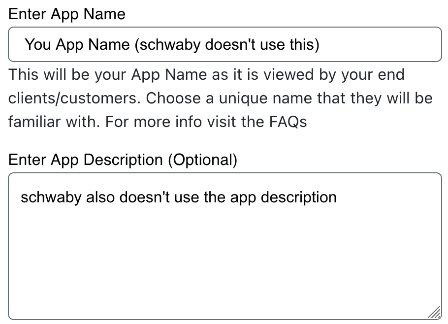

.. _getting_started:

===============
Getting Started
===============

Welcome to ``schwaby``. This page takes you from nothing to a working install:
a registered Schwab application, its credentials, and the library itself.

.. warning::

   This library places real orders against real accounts, there is no paper
   trading, and it has bugs --- see the caution on :ref:`the front page
   <index>`. Everything you place with it is your responsibility and your risk.

+++++++++++++++++
Schwab API Access
+++++++++++++++++

Before ``schwaby`` can do anything, you need a developer account with Schwab
and a registered application. This section gets you the three things the
library requires:

1. An application, approved and ready for use.
#. A callback URL, saved exactly as you entered it.
#. An app key and an app secret.

**Create a developer account**

Sign up at the `Schwab developer site <https://developer.schwab.com/>`__.
Everything below assumes you are logged in.

**Create an application**

.. figure:: _static/setting-up-create-app.png

From your dashboard, create an application and fill in the required fields.
The next few headings walk through them.

**API product**

.. figure:: _static/setting-up-api-product.png

Schwab does not document the difference between "Accounts and Trading
Production" and "Market Data" in a way that settles the question. The former
grants access to every endpoint ``schwaby`` supports, quotes and price history
included, so choose that one unless you have a specific reason not to.

**Order limit**

.. figure:: _static/setting-up-order-limit.png

This caps how many order-placing requests your app may make per minute, per
account. Exceed it and the requests are rejected.

Schwab allows anything from 0 to 120, so **120 is the maximum** and there is
rarely a reason to ask for less. Only ``POST``, ``PUT`` and ``DELETE`` order
requests count against it; reading orders is unthrottled.

**App name and description**

``schwaby`` never reads these, but people at Schwab may. Be descriptive: the
approver deciding whether to enable your app has little else to go on.

**Callback URL**

.. figure:: _static/setting-up-callback-url.png

This one matters, and it is the field most likely to cost you an afternoon.

The `OAuth login flow
<https://requests-oauthlib.readthedocs.io/en/latest/oauth2_workflow.html#web-application-flow>`__
Schwab uses opens a login page, collects your credentials on Schwab's own
domain, and then sends an HTTP request to your callback URL carrying the
ingredients for a token.

**Most users should enter** ``https://127.0.0.1:8182`` --- note the absence of
a trailing slash. The credentials then come back to your own machine on port
``8182`` rather than to any external server. A port number is not required to
use ``schwaby`` at all, but it is required for :ref:`certain convenient
features <login_flow>`. A non-local callback URL is possible; this
documentation assumes anyone attempting one does not need our help to do it.

Whatever you choose, pass it to ``schwaby`` **character for character** as you
entered it here. Any difference at all --- an added or removed trailing slash
is the usual one --- produces failures that are hard to trace back to their
cause.

If Schwab refuses to create an app with a ``127.0.0.1`` callback URL, please
`open an issue <https://github.com/Hu1kSmash/schwaby/issues>`__. It happens
intermittently and it is worth knowing whether it still does.

.. _approved_pending:

**Waiting for approval**

.. figure:: _static/setting-up-approved-pending.png

.. figure:: _static/setting-up-ready-for-use.png

A newly created app usually shows as ``Approved - Pending``. Do not be misled
by the word ``Approved``: the app is not usable yet. You are waiting for the
status to become ``Ready For Use``, which can take a few days. Nothing in
``schwaby`` will work until it does.

**App key and secret**

.. figure:: _static/setting-up-secrets.png

Once the app is approved, open it from the dashboard to find your app key and
app secret. You will pass both to ``schwaby``.

Treat them as you would a password. This library sends them to official Schwab
endpoints and nowhere else --- not to its authors, not anywhere. The values
shown in the screenshot are fake.

++++++++++++++++++++++
Installing ``schwaby``
++++++++++++++++++++++

This section covers installing ``schwaby`` to use it. To work on the library
itself, see :ref:`contributing`.

Install with ``pip`` from `PyPI <https://pypi.org/project/schwaby/>`__, into a
`virtualenv <https://virtualenv.pypa.io/en/latest/>`__. Creating one first,
called ``my-venv`` here:

.. code-block:: shell

  pip install virtualenv
  virtualenv -v my-venv
  source my-venv/bin/activate

Then install the library. The distribution is called ``schwaby`` and the
package you import is called ``schwab``:

.. code-block:: shell

  pip install schwaby

.. warning::

  ``schwaby`` and ``schwab-py`` cannot be installed together, and installing
  one over the other is worse than it sounds. Both provide the ``schwab``
  package and ``pip`` does not know they are the same project, so both end up
  registered and both claim the same files.

  Modules removed in the newer version survive on disk and stay importable. And
  ``pip uninstall schwab-py`` afterwards deletes the shared files and destroys
  the install --- ``pip`` still lists ``schwaby``, but ``import schwab`` raises
  ``ModuleNotFoundError``.

  ``pip`` never warns about this --- it does not implement ``Conflicts-Dist``,
  and a wheel runs no code when it is installed. ``import schwab`` does warn,
  but **only if** ``schwaby`` was installed last: both projects ship a
  ``schwab/__init__.py``, whichever is installed second overwrites the other's,
  and installing ``schwab-py`` over ``schwaby`` removes the file that carries
  the check. Silence is not evidence that the install is clean.

  Migrating from ``schwab-py``? Uninstall it **first**:

  .. code-block:: shell

    pip uninstall -y schwab-py && pip install schwaby

Check that it worked:

.. code-block:: python

  import schwab

A virtualenv is per-terminal. Open a new one and you will need to activate it
again; to leave it in the current terminal, run:

.. code-block:: shell

  deactivate

That is the whole install. Next is :ref:`auth`, which turns your app key and
secret into a token the client can use.

++++++++++++
Getting Help
++++++++++++

Stuck? `Open an issue <https://github.com/Hu1kSmash/schwaby/issues>`__ and ask.
If you think you have found a bug, :ref:`fill out a bug report <help>`.
